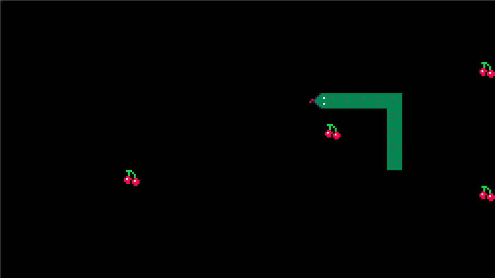

# PySnake

a simple clone of snake game using pygame.

## Screenshots


## Roadmap for 1.0

- [x] Basic Release
- [ ] Cut Snake
- [ ] Scoring System
- [ ] Pause Menu
- [ ] Themes

## Installation and running

Soon will write a setup.py
```bash
git clone https://github.com/pranavtaysheti/PySnake
cd PySnake
python -m pysnake
```

## Credits

I used following 3rd party assets for this game.

- ["Snake game assets" by cosmo](https://cosme.itch.io/snake)
- ["FFF Forward Font" by Fonts For Flash](https://www.1001fonts.com/fff-forward-font.html)

## License

GNU General Public License v3.0 or later
